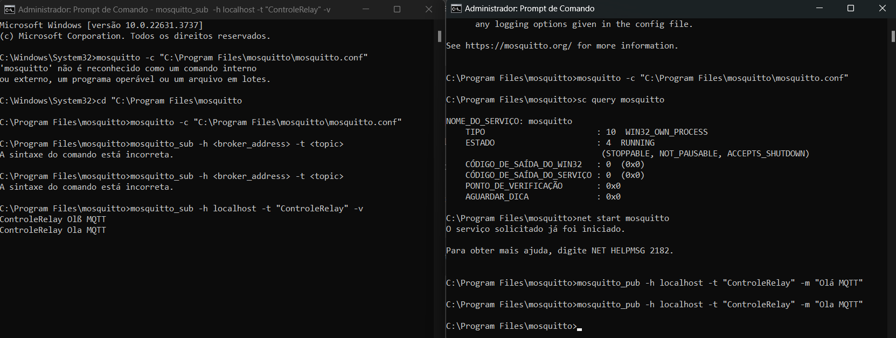
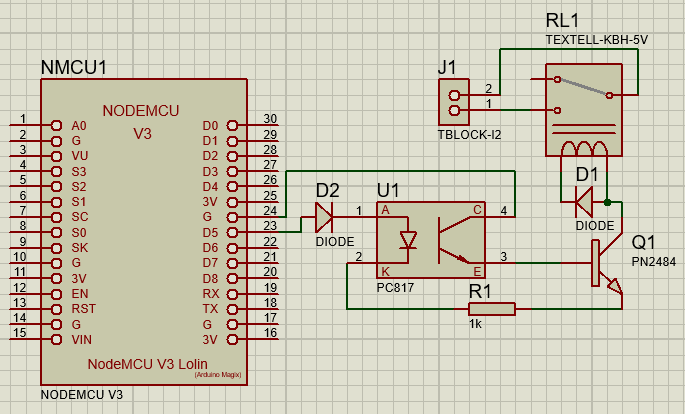
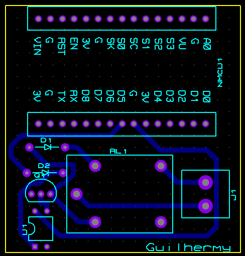
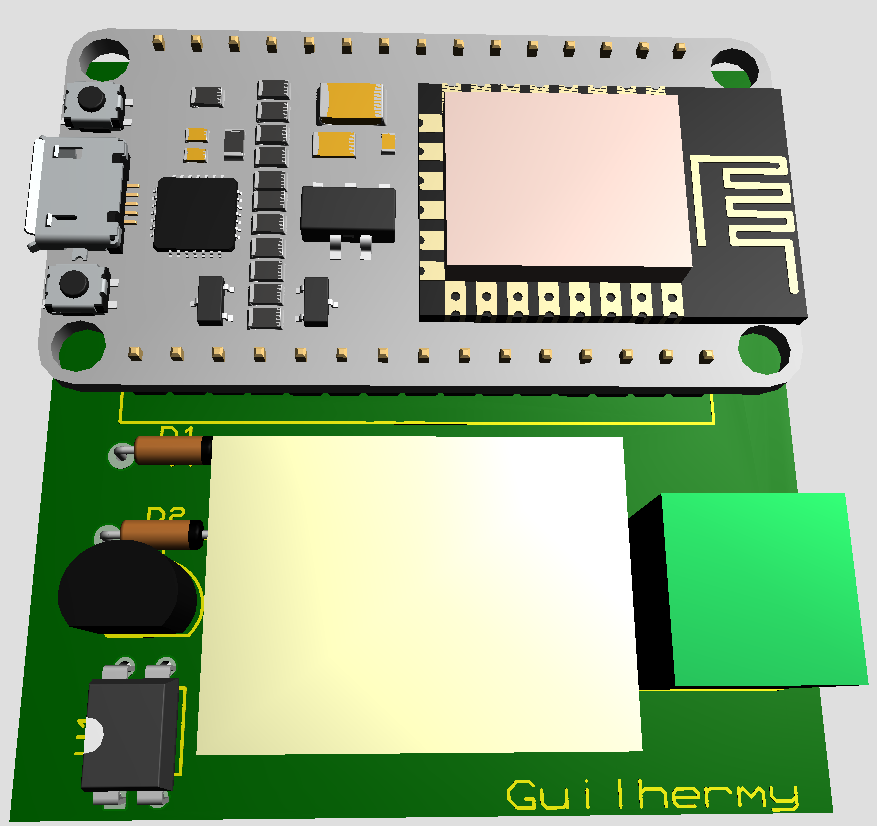

# MQTT

O MQTT é um protocolo de comunicação voltado a dispositivos com recursos computacionais limitados, comumente utilizado para transmissão de dados entre sistemas embarcados.

Sendo uma ferramenta de mensageria, o MQTT serve como intermediário entre a fonte dos dados e quem o consome. Um exemplo que representa seu funcionamento é o Spotify, que serve como intermediário entre os artistas, que produzem suas obras e as publicam lá, e os consumidores, que consomem as obras publicadas.

Os componentes do MQTT podem ser explicados da seguinte forma:

- Broker: é o servidor que armazena e gerencia os dados por tempo definido pelo usuário.
- Publisher (Publicador): publisher é o que produz o dado e o envia ao broker.
- Consumer (Consumidor): o consumer realiza consultas no broker de tempos em tempos, verificando os dados armazenados no broker.

- Mensagem: uma mensagem é um conjunto de dados enviados pelo publisher ao broker.
- Tópico: as mensagens podem ser organizadas de acordo com tópicos, como se fosse uma tabela em um banco de dados.

<h4>Imagem 1 - Criação do broker, pub e sub</h4>

<h4>Imagem 2 - Esquemático</h4>

<h4>Imagem 3 - PCB</h4>

<h4>Imagem 4 - 3D</h4>

